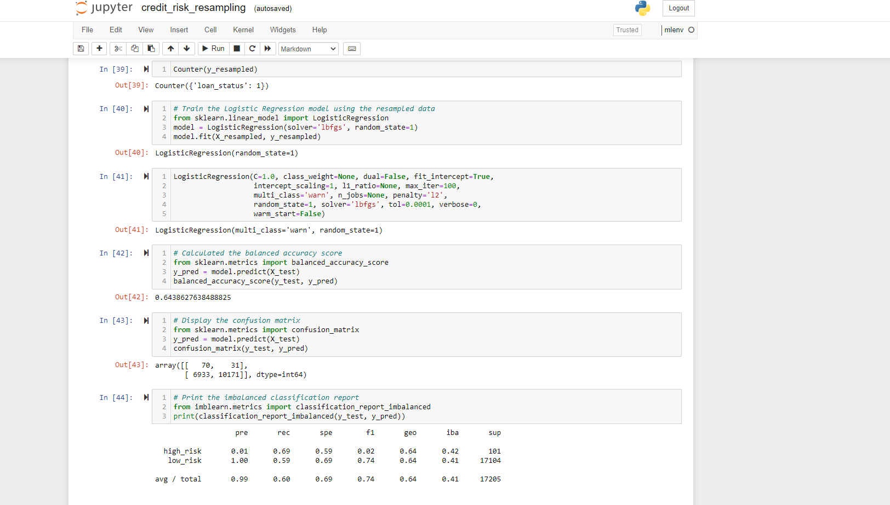

# Project: Credit_Risk_Analysis

# Project Sponsor: Lending Services

# Project Scope: 

Credit risk is an inherently unbalanced classification problem, as good loans easily outnumber risky loans. Therefore, using different techniques to train and evaluate models with unbalanced classes. 

Using the credit card credit dataset from LendingClub, a peer-to-peer lending services company, Oversample the data using the RandomOverSampler and SMOTE algorithms, and undersample the data using the ClusterCentroids algorithm.

Also using a combinatorial approach of over- and undersampling using the SMOTEENN algorithm.

Compare two new machine learning models that reduce bias, BalancedRandomForestClassifier and EasyEnsembleClassifier, to predict credit risk. 

Eevaluate the performance of these models and make a written recommendation on whether they should be used to predict credit risk.

# Resource:

Juyter notebook, imbalanced-learn and scikit-learn libraries

# Task: Evaluate three machine learning models by using resampling to determine which is better at predicting credit risk. 

# Deliverables:

Deliverable 1: Use Resampling Models to Predict Credit Risk

Resources: Imbalanced-learn and scikit-learn libraries

Task:  Use RandomOverSampler and SMOTE algorithms, and undersampling ClusterCentroids algorithm  resample the dataset, view the count of the target classes, train a logistic regression classifier, calculate the balanced accuracy score, generate a confusion matrix, and generate a classification report.

Deliverable 2: Use the SMOTEENN Algorithm to Predict Credit Risk

Resources: Imbalanced-learn and scikit-learn libraries and combinatorial approach of over- and undersampling with the SMOTEENN algorithm

Task: To determine if the results from the combinatorial approach are better at predicting credit risk than the resampling algorithms from Deliverable 1.

Deliverable 3: Use Ensemble Classifiers to Predict Credit Risk

Resources:  imblearn.ensemble library

Task: Comparing two different ensemble classifiers, BalancedRandomForestClassifier and EasyEnsembleClassifier, to predict credit risk and evaluate each model.

Deliverable 4: A Written Report on the Credit Risk Analysis

Overview of the analysis: Comparing two new machine learning models that reduce bias, BalancedRandomForestClassifier and EasyEnsembleClassifier, to predict credit risk.

Results: 
Balanced accuracy scores and the precision and recall scores of all six machine learning models screen shots are as appears in Deliverable 1,2 and 3.

Summary:

1. Rresults of oversampling and undersampling is completed and reported. 

2. The improvements seem to be modest

3. Incremental improvements are more realistic than drastic ones.

4. Small improvements, in tandem with other tweaks, can add up to make a significant difference.

5. For now, however, an approach to resampling that combines aspects of both oversampling and undersampling.
 
6. Here is we can see diferrence betwenn accuracy score that varies from 0.79 to 0.93 and also confusion matrix range is been wider tha expected for high risk. 

7. To improve this model, we can drop some of the lower ranked features.

8. From the confusion matrix results, the precision for the bad loan applications is low, indicating a large number of false positives, which indicates an unreliable positive classification.